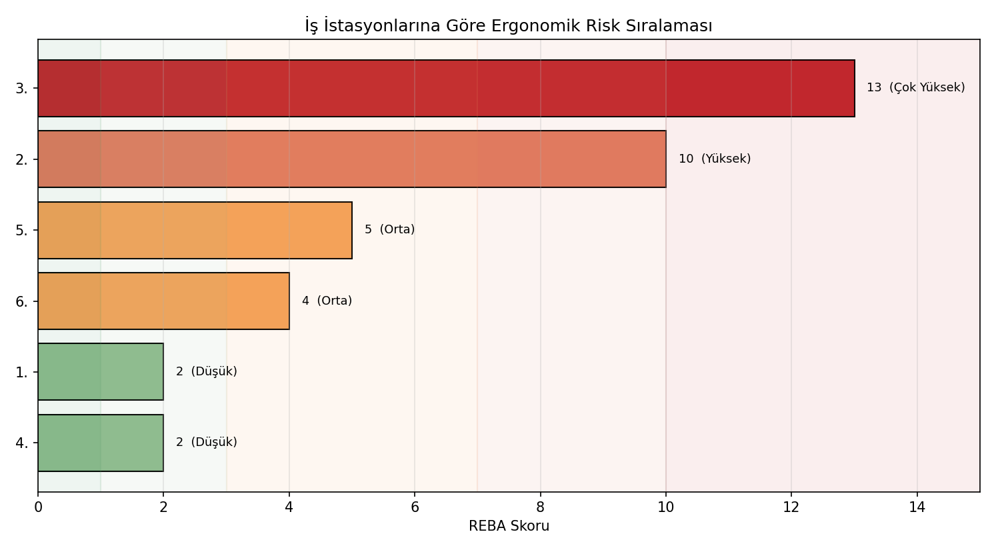
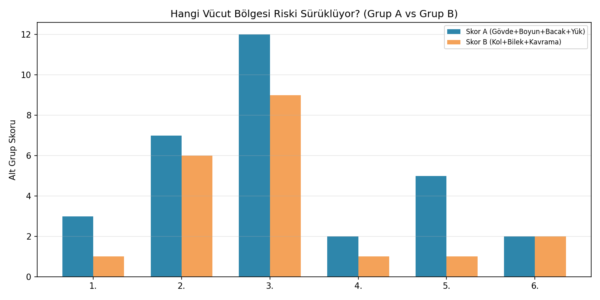
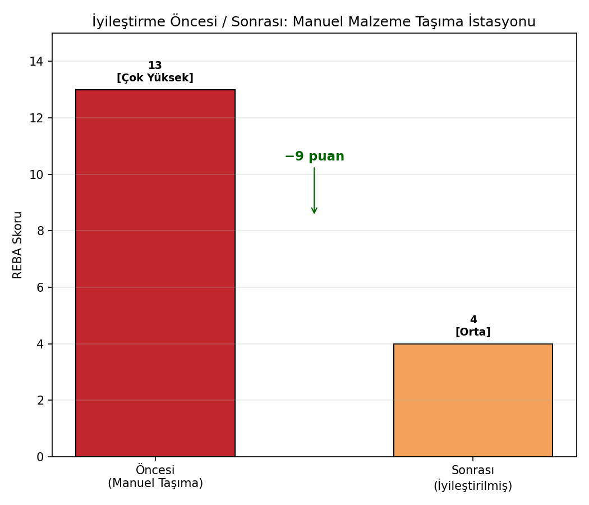

# reba-ergonomik-risk-degerlendirme

REBA (Rapid Entire Body Assessment) yöntemi ile iş istasyonlarında ergonomik risk değerlendirmesi — 6 farklı istasyon karşılaştırması ve iyileştirme senaryosu.

## Ekip

| İsim | Görev/Sorumluluk | GitHub |
|---|---|---|
| Burak Efe Arslantürk | REBA skorlama motoru (Tablo A/B/C), proje koordinasyonu | @burakefearslanturk |
| Ceren Gündüz | İş istasyonu senaryoları, veri toplama, iyileştirme önerisi tasarımı | @cerengunduz |
| Şevval Bengü Gündüz | Görselleştirme, sonuçların yorumlanması, README ve sunum | @sevvallbengu |

## Görev Dağılımı

| Görev | Sorumlu | Durum |
|---|---|---|
| REBA Tablo A/B/C lookup mantığının kodlanması, alt-skor fonksiyonları | Burak Efe Arslantürk | ✅ Tamamlandı |
| 6 iş istasyonu için gerçekçi duruş senaryolarının oluşturulması | Ceren Gündüz | ✅ Tamamlandı |
| En riskli istasyon için iyileştirme (before/after) senaryosunun tasarlanması | Ceren Gündüz | ✅ Tamamlandı |
| Risk sıralaması, grup kırılımı ve iyileştirme karşılaştırma grafiklerinin çizilmesi | Şevval Bengü Gündüz | ✅ Tamamlandı |
| Sonuçların yorumlanması, README derlenmesi | Şevval Bengü Gündüz | ✅ Tamamlandı |

*Bu dağılım öneridir; ekip olarak anlaştığınız gibi değiştirebilirsiniz.*

## Problem

İş sağlığı ve güvenliği (İSG) kapsamında, çalışanların iş istasyonlarında aldığı duruşların **kas-iskelet sistemi hastalıkları (KİSH)** riski açısından değerlendirilmesi gerekir. Bu değerlendirme sübjektif gözlemle değil, **standartlaştırılmış, tekrarlanabilir bir puanlama sistemiyle** yapılmalıdır.

## Yöntem: REBA (Hignett & McAtamney, 2000)

REBA, tüm vücut duruşunu iki gruba ayırarak değerlendirir:

- **Grup A:** Gövde + Boyun + Bacaklar → Tablo A → *Duruş Skoru A* → + Yük/Kuvvet Skoru → **Skor A**
- **Grup B:** Üst Kol + Alt Kol + Bilek → Tablo B → *Duruş Skoru B* → + Kavrama Skoru → **Skor B**

Skor A ve Skor B, **Tablo C**'de kesiştirilerek temel REBA skoru bulunur. Buna **Aktivite Skoru** (statik duruş, tekrarlı hareket, dengesiz taban) eklenerek **nihai REBA skoru (1-15)** elde edilir.

> **Neden REBA, RULA değil?** RULA sadece üst uzuvlara (masa başı iş, hafif montaj) odaklanır. REBA ise gövde ve bacakları da içerdiği için **manuel malzeme taşıma, kaldırma, itme-çekme** gibi tüm vücudu ilgilendiren ağır işler için daha uygundur — bu projede kaynak, malzeme taşıma gibi istasyonlar da değerlendirildiği için REBA seçildi.

### Risk Seviyeleri

| REBA Skoru | Risk Seviyesi | Aksiyon |
|---|---|---|
| 1 | İhmal Edilebilir | Aksiyon gerekmez |
| 2-3 | Düşük | Değişiklik gerekebilir |
| 4-7 | Orta | Araştırılmalı, yakında değişiklik |
| 8-10 | Yüksek | Araştırılmalı, değişiklik uygulanmalı |
| 11-15 | Çok Yüksek | ACİL değişiklik gerekli |

## İçerik

| Dosya | Açıklama | Sorumlu |
|---|---|---|
| `reba_skorlama.py` | Tablo A/B/C, alt-skor fonksiyonları, ana REBA hesaplama motoru | Burak Efe Arslantürk |
| `senaryolar.py` | 6 iş istasyonu senaryosu + iyileştirme senaryosu | Ceren Gündüz |
| `gorsel.py` | Risk sıralaması, grup kırılımı, iyileştirme karşılaştırma grafikleri | Şevval Bengü Gündüz |
| `requirements.txt` | Gerekli Python paketleri | — |

## Kullanım

```bash
pip install -r requirements.txt

# Tek bir örnek duruşun REBA skorunu görmek için
python reba_skorlama.py

# 6 istasyonun tam değerlendirmesini konsolda görmek için
python senaryolar.py

# Tüm görselleri (PNG) üretmek için
python gorsel.py
```

## Sonuçlar

6 iş istasyonunun REBA değerlendirmesi (riske göre sıralı):

| İstasyon | REBA Skoru | Risk Seviyesi |
|---|---|---|
| 3. Manuel Malzeme Taşıma (Kaldırma) | **13** | Çok Yüksek |
| 2. Kaynak İstasyonu (Ayakta, Eğilerek) | 10 | Yüksek |
| 5. Forklift Operatörü | 5 | Orta |
| 6. Bilgisayar Destekli Tasarım (Ofis) | 4 | Orta |
| 1. Kalite Kontrol Masası (Oturarak) | 2 | Düşük |
| 4. Montaj Hattı (Ayakta, Hafif İş) | 2 | Düşük |

**Grup kırılımı analizi** (hangi vücut bölgesi riski sürüklüyor?) gösteriyor ki en riskli iki istasyonda (Manuel Taşıma, Kaynak) hem Grup A (gövde eğilmesi, ağır yük) hem Grup B (kol/bilek duruşu) yüksek — yani tekli bir müdahale yetmez, **kombine bir iyileştirme** gerekir.

### İyileştirme Senaryosu

En riskli istasyon (Manuel Malzeme Taşıma, REBA=13, Çok Yüksek) için önerilen değişiklikler:
- Yükseklik ayarlı platform → gövde eğilme açısı 70°'den 20°'ye düşürüldü
- Kanca/kaldırma yardımcısı → kavrama skoru "kötü"den "iyi"ye çıkarıldı
- Yük ikiye bölündü (22 kg → 11 kg) ve mekanik yardımla ani kuvvet ortadan kaldırıldı

**Sonuç: REBA skoru 13 → 4 (Çok Yüksek → Orta), 9 puanlık iyileşme.**





## Şeffaflık Notu

Tablo A, B, C değerleri yayınlanmış REBA metodolojisinden (Hignett & McAtamney, 2000) derlenmiştir. Bu proje eğitim/portföy amaçlıdır; **gerçek bir İSG değerlendirmesinde kullanılmadan önce** değerlerin orijinal makale veya sertifikalı bir REBA formuyla karşılaştırılması ve saha gözlemlerinin bir ergonomist tarafından doğrulanması önerilir.

## Genişletme Fikirleri

- **Video/görüntü işleme entegrasyonu:** MediaPipe/OpenPose ile gerçek çalışan görüntülerinden otomatik açı çıkarımı.
- **RULA ile karşılaştırma:** Masa başı istasyonlar için RULA sonuçlarının REBA ile kıyaslanması.
- **Zaman serisi izleme:** Bir vardiya boyunca tekrarlı ölçümlerle risk skorunun zamana yayılımı.
- **Maliyet-fayda analizi:** İyileştirme yatırımının, azalan iş kazası/meslek hastalığı riskiyle karşılaştırılması.

## Kaynak

Hignett, S., McAtamney, L. (2000). *Rapid Entire Body Assessment (REBA).* Applied Ergonomics, 31(2), 201-205.
